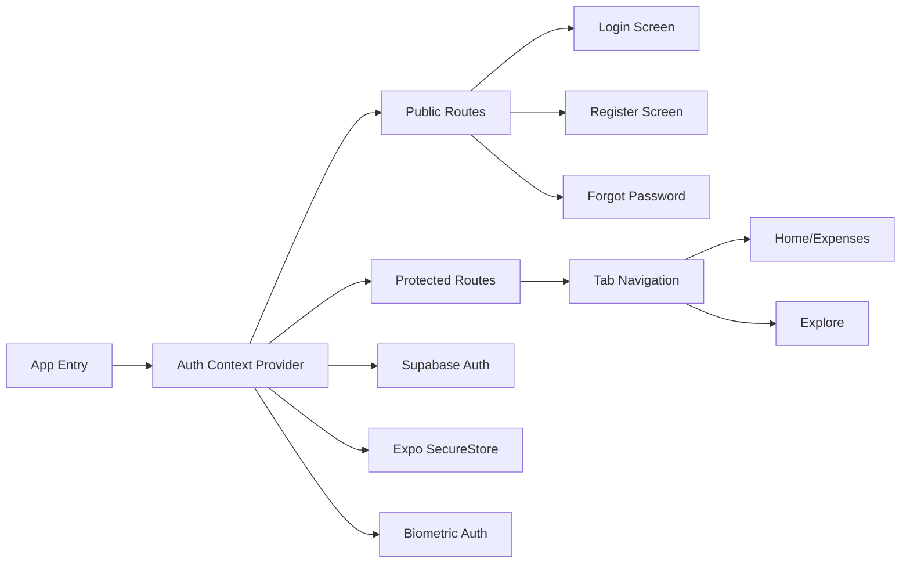

# Authentication Implementation Plan

## Technology Stack

- **Backend**: Supabase (authentication + PostgreSQL database)
- **Secure Storage**: expo-secure-store (for tokens)
- **Biometric Auth**: expo-local-authentication (Face ID, Touch ID, Fingerprint)
- **Navigation**: Expo Router (already set up)
- **State Management**: React Context API

## Architecture Overview



## Implementation Steps

### 1. Install Required Dependencies

Add the following packages to `[package.json](package.json)`:

```bash
npx expo install @supabase/supabase-js expo-secure-store expo-local-authentication
```

- `@supabase/supabase-js`: Supabase client for authentication and database
- `expo-secure-store`: Secure token storage (encrypted)
- `expo-local-authentication`: Biometric authentication support

### 2. Set Up Supabase Project

**Manual steps** (you'll need to do this):

- Go to [supabase.com](https://supabase.com) and create a free account
- Create a new project
- Get your project URL and anon key from Project Settings > API
- Enable Email Auth in Authentication > Providers
- Configure email templates in Authentication > Email Templates

### 3. Create Supabase Configuration

Create `[lib/supabase.ts](lib/supabase.ts)`:

- Initialize Supabase client with URL and anon key
- Configure secure storage for session persistence
- Set up custom storage adapter using expo-secure-store

```typescript
// Key implementation details:
// - Use SecureStore for storing/retrieving auth tokens
// - Configure auto-refresh for sessions
// - Set up proper TypeScript types for auth state
```

### 4. Create Authentication Context

Create `[contexts/AuthContext.tsx](contexts/AuthContext.tsx)`:

- Manage global authentication state (user, session, loading)
- Provide auth methods: signUp, signIn, signOut, resetPassword
- Handle biometric authentication toggle
- Persist biometric preference
- Auto-restore session on app launch

```typescript
// Key features:
// - useAuth() hook for accessing auth state
// - Session persistence across app restarts
// - Loading states for async operations
// - Error handling with user-friendly messages
```

### 5. Update Root Layout for Auth Protection

Modify `[app/_layout.tsx](app/_layout.tsx)`:

- Wrap app with AuthProvider
- Add auth state listener
- Implement route protection logic
- Redirect unauthenticated users to login

```typescript
// Navigation flow:
// - Check if user is authenticated
// - If not authenticated -> redirect to /auth/login
// - If authenticated -> show (tabs)
// - Handle initial loading state
```

### 6. Create Authentication Screens

Create new authentication screens in `app/auth/` directory:

**a) Login Screen** - `[app/auth/login.tsx](app/auth/login.tsx)`:

- Email and password input fields
- Biometric authentication option (if enabled and available)
- "Remember me" functionality (default on)
- Link to register screen
- Link to forgot password
- Form validation with error messages
- Loading states during authentication

**b) Register Screen** - `[app/auth/register.tsx](app/auth/register.tsx)`:

- Email, password, and confirm password fields
- Password strength indicator
- Terms of service agreement checkbox
- Auto-login after successful registration
- Email verification notice
- Form validation (password match, email format, strong password)

**c) Forgot Password Screen** - `[app/auth/forgot-password.tsx](app/auth/forgot-password.tsx)`:

- Email input for password reset
- Send reset email via Supabase
- Success message with instructions
- Link back to login

**d) Reset Password Screen** - `[app/auth/reset-password.tsx](app/auth/reset-password.tsx)`:

- New password and confirm password fields
- Handle deep link from email
- Update password via Supabase
- Redirect to login after success

### 7. Create Auth Layout

Create `[app/auth/_layout.tsx](app/auth/_layout.tsx)`:

- Stack navigator for auth screens
- Consistent header styling
- Handle back navigation
- Prevent going back to auth screens when logged in

### 8. Add Biometric Authentication Setup

Create `[components/BiometricSetup.tsx](components/BiometricSetup.tsx)`:

- Check device biometric capabilities
- Prompt user to enable biometric auth after first login
- Store biometric preference in SecureStore
- Show appropriate UI based on device type (Face ID vs Touch ID vs Fingerprint)

### 9. Create Reusable Auth Components

Create components in `components/auth/`:

**a) Input Field** - `[components/auth/AuthInput.tsx](components/auth/AuthInput.tsx)`:

- Themed text input with icon support
- Show/hide password toggle
- Error state styling
- Accessible labels

**b) Auth Button** - `[components/auth/AuthButton.tsx](components/auth/AuthButton.tsx)`:

- Primary action button with loading state
- Disabled state handling
- Consistent styling across auth screens

**c) Social Auth Buttons** - `[components/auth/SocialAuthButtons.tsx](components/auth/SocialAuthButtons.tsx)`:

- Placeholder for future social auth (Google, Apple)
- Proper branding and styling
- Can be implemented later

### 10. Update Tab Navigation

Modify `[app/(tabs)/_layout.tsx](<app/(tabs)`/layout.tsx>):

- Add logout option in settings
- Show user email/profile info
- Add biometric settings toggle

### 11. Create Auth Utilities

Create `[lib/auth-utils.ts](lib/auth-utils.ts)`:

- Email validation
- Password strength checker
- Biometric authentication helper functions
- Error message formatter for Supabase errors

### 12. Update Home Screen

Modify `[app/(tabs)/index.tsx](<app/(tabs)`/index.tsx>):

- Show personalized welcome message with user email
- Remove placeholder content
- Add logout button
- Show loading state while checking auth

### 13. Add Email Verification Flow

Create `[app/auth/verify-email.tsx](app/auth/verify-email.tsx)`:

- Show after registration
- Resend verification email option
- Check verification status
- Auto-redirect when verified

### 14. Environment Variables

Create `[.env](.env)` (git-ignored):

```
EXPO_PUBLIC_SUPABASE_URL=your-project-url
EXPO_PUBLIC_SUPABASE_ANON_KEY=your-anon-key
```

Update `[.gitignore](.gitignore)` to include `.env`

### 15. TypeScript Types

Create `[types/auth.ts](types/auth.ts)`:

- User type
- Session type
- AuthError type
- BiometricType enum

## File Structure

```
app/
├── _layout.tsx (wrap with AuthProvider, add auth checks)
├── (tabs)/
│   ├── _layout.tsx (add logout, settings)
│   └── index.tsx (update with user info)
└── auth/
    ├── _layout.tsx (auth stack navigator)
    ├── login.tsx
    ├── register.tsx
    ├── forgot-password.tsx
    ├── reset-password.tsx
    └── verify-email.tsx

contexts/
└── AuthContext.tsx (global auth state)

lib/
├── supabase.ts (Supabase client config)
└── auth-utils.ts (validation, helpers)

components/
├── BiometricSetup.tsx
└── auth/
    ├── AuthInput.tsx
    ├── AuthButton.tsx
    └── SocialAuthButtons.tsx

types/
└── auth.ts (TypeScript types)
```

## Security Considerations

1. **Token Storage**: Use expo-secure-store (encrypted storage) for refresh tokens
2. **Biometric Auth**: Only store a flag, require re-authentication for sensitive actions
3. **Password Requirements**: Minimum 8 characters, mix of letters and numbers
4. **Session Management**: Auto-refresh tokens, handle expiration gracefully
5. **Email Verification**: Require verification before full access (optional)
6. **Rate Limiting**: Supabase provides built-in rate limiting

## Testing Checklist

After implementation, test:

- Register new user with valid email
- Receive and verify email verification link
- Login with correct credentials
- Login fails with wrong password
- Request password reset email
- Reset password via email link
- Enable biometric authentication
- Login with biometric (after enabled)
- Session persists after app restart
- Logout clears session
- Protected routes redirect to login when not authenticated
- Biometric fails gracefully when not available

## Next Steps After Auth

Once authentication is complete, you can:

1. Create expense tracking features (CRUD operations)
2. Set up Supabase database tables for expenses
3. Implement data sync with Supabase
4. Add expense categories, budgets, and reports
5. Implement data export/backup features
